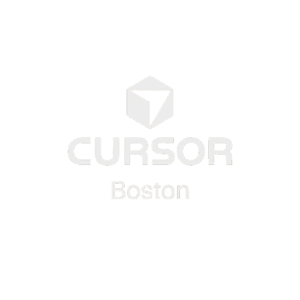

#  Cursor Boston

<p align="center">
  <strong>The hub for Boston's AI-powered development community.</strong><br />
  Built by builders, for builders, using <a href="https://cursor.com">Cursor</a>.
</p>

<p align="center">
  <a href="https://github.com/rogerSuperBuilderAlpha/cursor-boston/pulls"></a>
  <a href="https://discord.gg/Wsncg8YYqc"></a>
  <a href="https://lu.ma/cursor-boston"></a>
  <a href="LICENSE"></a>
</p>

---

## 🏙️ What is Cursor Boston?

Cursor Boston is a community-led platform designed to bring together the most ambitious developers, students, and founders in the Boston area. We focus on **AI-native development workflows**—leveraging tools like Cursor to ship production code at the speed of thought.

### 🎯 Who is this for?
- **🎓 Students**: MIT, Harvard, Hult, BU, Northeastern, and beyond.
- **🚀 Founders**: Prototype MVPs in hours and validate ideas fast.
- **💻 Developers**: Master the art of AI-assisted full-stack development.
- **🎨 Designers & PMs**: Bridge the gap between design and production code.

---

## 🛠️ The Build Stack

This platform is a living example of what you can build with Cursor and modern web tech:

- **Frontend**: Next.js 14 (App Router), Tailwind CSS, TypeScript
- **Backend**: Firebase (Auth, Firestore, Storage)
- **Integrations**: Discord/GitHub OAuth, Luma API, Framer Motion

---

## 📚 Community

- [Contributing Guide](.github/CONTRIBUTING.md) - How to contribute to this project
- [Code of Conduct](.github/CODE_OF_CONDUCT.md) - Our community standards
- [Security Policy](.github/SECURITY.md) - How to report security vulnerabilities

---

## 💡 Contribution Ideas (Get Involved!)

We want your PRs! Whether you're fixing a typo or building a major feature, here's what we're looking for:

### 🚀 High-Impact Features
- **[Hard] AI-Powered Member Search**: Implement a semantic search for the member directory using vector embeddings.
- **[Medium] Real-time Event Chat**: Add a live chat component to event pages using Firestore listeners.
- **[Medium] GitHub Contribution Sync**: Automatically display a member's latest GitHub activity on their profile.
- **[Easy] Dark Mode Toggle**: A simple but essential addition for the late-night builders.

### 🔧 Core Improvements
- **Accessibility Audit**: Help us reach 100% WCAG compliance.
- **Test Coverage**: We're aiming for 80%+ coverage with Jest and Playwright.
- **Performance**: Optimize image delivery and server-side rendering.

### 🎨 Design & UX
- **Framer Motion Transitions**: Add smooth page transitions and micro-interactions.
- **Component Library**: Help us extract our UI into a clean, reusable component set.

---

## 🏃 Quick Start

1. **Clone the repo**
   ```bash
   git clone https://github.com/rogerSuperBuilderAlpha/cursor-boston.git
   cd cursor-boston
   ```

2. **Install & Setup**
   ```bash
   npm install
   cp .env.local.example .env.local
   ```

3. **Run Dev**
   ```bash
   npm run dev
   ```

---

## 🗺️ Roadmap
- [x] **v0.1**: Initial Community Hub & Event Tracking
- [ ] **v0.2**: Enhanced Member Profiles & Social Integration
- [ ] **v0.3**: Community Discussion Boards
- [ ] **v0.4**: PWA & Mobile Optimization

---

<p align="center">
  <strong>Made with ❤️ in Boston.</strong><br />
  Join us on <a href="https://discord.gg/Wsncg8YYqc">Discord</a> or <a href="https://lu.ma/cursor-boston">Luma</a>.
</p>
# Webhook test Tue Jan 27 14:03:34 EST 2026