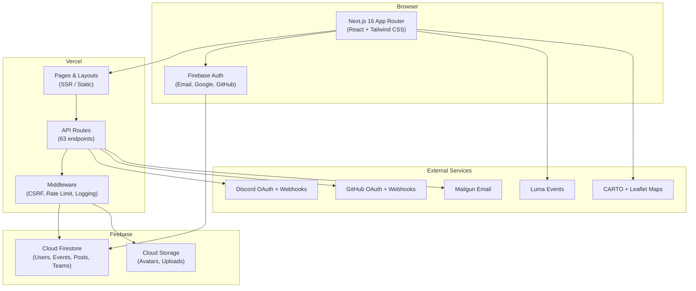

#  Cursor Boston

<p align="center">
  <strong>The hub for Boston's AI-powered development community.</strong><br />
  Built by builders, for builders, using <a href="https://cursor.com">Cursor</a>.
</p>

<p align="center">
  <a href="https://github.com/rogerSuperBuilderAlpha/cursor-boston/pulls"></a>
  <a href="https://discord.gg/Wsncg8YYqc"></a>
  <a href="https://lu.ma/cursor-boston"></a>
  <a href="LICENSE"></a>
</p>

---

## 🏙️ What is Cursor Boston?

Cursor Boston is a community-led platform designed to bring together the most ambitious developers, students, and founders in the Boston area. We focus on **AI-native development workflows**—leveraging tools like Cursor to ship production code at the speed of thought.

### 🎯 Who is this for?
- **🎓 Students**: MIT, Harvard, Hult, BU, Northeastern, and beyond.
- **🚀 Founders**: Prototype MVPs in hours and validate ideas fast.
- **💻 Developers**: Master the art of AI-assisted full-stack development.
- **🎨 Designers & PMs**: Bridge the gap between design and production code.

---

## 🛠️ The Build Stack

This platform is a living example of what you can build with Cursor and modern web tech:

- **Frontend**: Next.js 16 (App Router), Tailwind CSS, TypeScript
- **Backend**: Firebase (Auth, Firestore, Storage)
- **Integrations**: Discord/GitHub OAuth, Luma API, Framer Motion

---

## 🏗️ Architecture


```mermaid
graph TB
    subgraph Client["Browser"]
        UI["Next.js 16 App Router<br/>(React + Tailwind CSS)"]
        Auth["Firebase Auth<br/>(Email, Google, GitHub)"]
    end

    subgraph Vercel["Vercel"]
        Pages["Pages & Layouts<br/>(SSR / Static)"]
        API["API Routes<br/>(63 endpoints)"]
        MW["Middleware<br/>(CSRF, Rate Limit, Logging)"]
    end

    subgraph Firebase["Firebase"]
        Firestore["Cloud Firestore<br/>(Users, Events, Posts, Teams)"]
        Storage["Cloud Storage<br/>(Avatars, Uploads)"]
    end

    subgraph External["External Services"]
        Discord["Discord OAuth + Webhooks"]
        GitHub["GitHub OAuth + Webhooks"]
        Luma["Luma Events"]
        Mailgun["Mailgun Email"]
        Leaflet["CARTO + Leaflet Maps"]
    end

    UI --> Pages
    UI --> Auth
    Auth --> Firestore
    Pages --> API
    API --> MW
    MW --> Firestore
    MW --> Storage
    API --> Discord
    API --> GitHub
    API --> Mailgun
    UI --> Luma
    UI --> Leaflet
```

---

## 🚀 Build Something

Want to add a major feature to the platform? We have **6 open feature projects** ready for contributors to claim and build:

| # | Feature | Issue |
|---|---------|-------|
| 1 | **Prompt & Rules Cookbook** — share and discover Cursor workflows | [#78](https://github.com/rogerSuperBuilderAlpha/cursor-boston/issues/78) |
| 2 | **Achievement Badge System** — gamified milestones for community activity | [#79](https://github.com/rogerSuperBuilderAlpha/cursor-boston/issues/79) |
| 3 | **AI Pair Programming Matchmaker** — find your coding partner | [#80](https://github.com/rogerSuperBuilderAlpha/cursor-boston/issues/80) |
| 4 | **Public Community Analytics Dashboard** — visualize community growth | [#81](https://github.com/rogerSuperBuilderAlpha/cursor-boston/issues/81) |
| 5 | **Interactive Community Event Map** — Boston venues on a live map | [#82](https://github.com/rogerSuperBuilderAlpha/cursor-boston/issues/82) |
| 6 | **Lightning Talk Timer & Speaker Queue** — real-time event tool | [#83](https://github.com/rogerSuperBuilderAlpha/cursor-boston/issues/83) |

Each feature is **fully isolated** — new routes, new Firestore collections, no entanglement with existing code. Pick one, comment to claim it, and ship it. See the [Contributing Guide](.github/CONTRIBUTING.md#claiming-an-issue) for how to get started.

---

## 📚 Community
- [GitHub Issues](https://github.com/rogerSuperBuilderAlpha/cursor-boston/issues) - Browse and claim open tasks
- [Contributing Guide](.github/CONTRIBUTING.md) - How to contribute to this project
- [Code of Conduct](.github/CODE_OF_CONDUCT.md) - Our community standards
- [Security Policy](.github/SECURITY.md) - How to report security vulnerabilities
- [Accessibility](.github/ACCESSIBILITY.md) - Our accessibility commitment and WCAG targets
- [API Reference](docs/API.md) - Full list of API endpoints

---

## 🏃 Quick Start

1. **Fork, then clone your fork** (contributions are not accepted via direct push to upstream)
   ```bash
   git clone https://github.com/your-username/cursor-boston.git
   cd cursor-boston
   ```
   Replace `your-username` with your GitHub account after forking. Open pull requests from branches on **your fork** only. To clone upstream read-only (no contribution), use `https://github.com/rogerSuperBuilderAlpha/cursor-boston.git` — you cannot push there as an outside contributor.

2. **Install & Setup**
   ```bash
   npm install
   cp .env.local.example .env.local
   ```

3. **Run Dev**
   ```bash
   npm run dev
   ```

## 🐳 Docker

A production-ready multi-stage Dockerfile is available at `docker/Dockerfile`:

```bash
# Build the image (pass Firebase config as build args)
docker build -f docker/Dockerfile \
  --build-arg NEXT_PUBLIC_FIREBASE_API_KEY=your-key \
  --build-arg NEXT_PUBLIC_FIREBASE_AUTH_DOMAIN=your-domain \
  --build-arg NEXT_PUBLIC_FIREBASE_PROJECT_ID=your-project \
  --build-arg NEXT_PUBLIC_FIREBASE_STORAGE_BUCKET=your-bucket \
  --build-arg NEXT_PUBLIC_FIREBASE_MESSAGING_SENDER_ID=your-id \
  --build-arg NEXT_PUBLIC_FIREBASE_APP_ID=your-app-id \
  --build-arg NEXT_PUBLIC_FIREBASE_DATABASE_URL=your-db-url \
  -t cursor-boston .

# Run the container
docker run -p 3000:3000 cursor-boston
```

The image uses Node 20 Alpine, runs as a non-root user, and includes a health check at `/api/health`.

---

## 🧰 Operations

### Rate-limit cleanup (internal maintenance)

Run the internal `apiRateLimits` cleanup endpoint from this repo:

```bash
CRON_SECRET=your-secret npm run rate-limit-cleanup
```

Optional environment variables:
- `RATE_LIMIT_CLEANUP_BASE_URL` (default: `http://localhost:3000`)
- `RATE_LIMIT_CLEANUP_DRY_RUN` (`true` for no-delete simulation)
- `RATE_LIMIT_CLEANUP_BATCH_SIZE` (clamped to `1-500`)
- `RATE_LIMIT_CLEANUP_MAX_BATCHES` (clamped to `1-20`)

Examples:

```bash
# Dry run against production URL
CRON_SECRET=your-secret RATE_LIMIT_CLEANUP_BASE_URL=https://cursorboston.com RATE_LIMIT_CLEANUP_DRY_RUN=true npm run rate-limit-cleanup

# Real cleanup with tighter bounds
CRON_SECRET=your-secret RATE_LIMIT_CLEANUP_BATCH_SIZE=200 RATE_LIMIT_CLEANUP_MAX_BATCHES=3 npm run rate-limit-cleanup
```

---

## 🗺️ Roadmap
- [x] **v0.1**: Initial Community Hub & Event Tracking
- [ ] **v0.2**: Enhanced Member Profiles & Social Integration
- [ ] **v0.3**: Community Discussion Boards
- [ ] **v0.4**: PWA & Mobile Optimization

---

<p align="center">
  <strong>Made with ❤️ in Boston.</strong><br />
  Join us on <a href="https://discord.gg/Wsncg8YYqc">Discord</a> or <a href="https://lu.ma/cursor-boston">Luma</a>.
</p>
